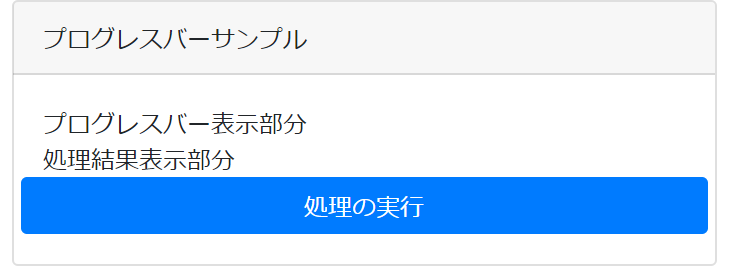
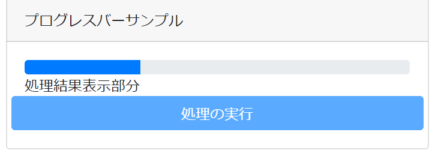
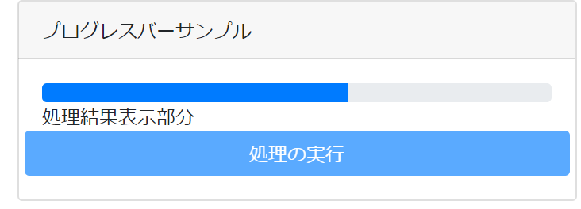
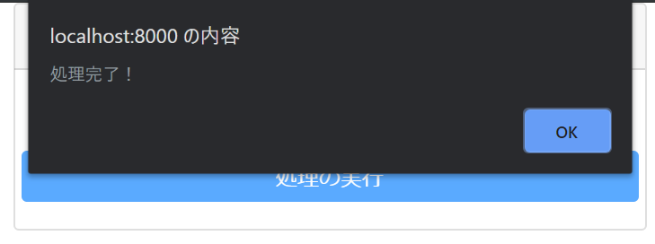

# Djangoでプログレスバー表示

## 初めに

hashiです。  
外部ツールを使いにくい現場でプログレスバーを実装する必要に駆られ、Django単体でプログレスバーを実装しました。  
後学者や今後の自分が忘れたときのためにその方法をまとめてみました。

## 全体の処理の流れ

(パワポのスクショ)

## 前提

- Windows 10
- Python 3.7.4

## プロジェクト用ディレクトリ作成

以下のコマンドを実行して適当な場所にDjangoプロジェクトを格納するためのディレクトリを作成し、その中に入ります。

```bash
mkdir progress_bar  # ディレクトリ作って
cd progress_bar     # その中に入る
```

## 仮想環境の作成

既にインストールされているパッケージの影響を受けることを避けるため、新しく作った仮想環境内で1から環境構築していきます。  
今回はパッケージ管理に`pipenv`を使用します。入っていない場合は、

```bash
pip install pipenv  # pipでインストール
```

を実行してください。その後、

```bash
export PIPENV_VENV_IN_PROJECT=true  # 仮想環境をプロジェクトディレクトリ配下に作るように設定
pipenv shell                        # 仮想環境作成！
```

これでまっさらな環境が作成できました。  
これ以降のコマンドは`pipenv shell`を実行して仮想環境に入った状態で実行することを前提とします。

## Djangoのインストール

以下のコマンドを実行してDjangoをインストールします。

```bash
pipenv install django
```

## プロジェクトの作成

以下のコマンドを実行してprojectを作成します。

```bash
django-admin startproject config .  #今のディレクトリにprojectを作成
```

現在のファイル構成は以下のようになります。

```bash
progress_bar
|--.venv
|--config
| |--__init__.py
| |--settings.py
| |--urls.py
| |--wsgi.py
|--manage.py
|--Pipfile
|--Pipfile.lock
```

## アプリの作成

`manage.py`と同階層で以下のコマンドを実行します。

```bash
mkdir apps                                  #アプリ用ディレクトリ作成
cd apps                                     #その中に…
python ../manage.py startapp example_app    #アプリ作成
```

作成したアプリを利用できるようにするために`config/settings.py`に以下の内容を追記します。

```python
# config/settings.py

INSTALLED_APPS = +["apps.example_app.apps.ExampleAppConfig"]
```

続けて`apps/example_app/apps.py`を書き換えます。

```python
# apps/example_app/apps.py
from django.apps import AppConfig


class ExampleAppConfig(AppConfig):
    # name = 'example_app'
    name = "apps.example_app"
```

## トップページのviewの作成

アプリのビューを以下のように記述します。

```python
# apps/example_app/views.py
from django.shortcuts import render

def index(request):
    """基本となるページ"""
    return render(request, "example_app/index.html")
```

## テンプレートの作成

テンプレートにプログレスバーを埋め込む部分を用意しておきます。  
Bootstrapはプログレスバーの装飾に使用します。

```html
<!-- apps\example_app\templates\example_app\index.html -->
<!DOCTYPE html>
<html lang="ja">
<head>
    <meta charset="utf-8" />
    <!-- Required meta tags -->
    <meta charset="utf-8">
    <meta name="viewport" content="width=device-width, initial-scale=1, shrink-to-fit=no">

    <!-- Bootstrap CSS -->
    <link rel="stylesheet" href="https://stackpath.bootstrapcdn.com/bootstrap/4.3.1/css/bootstrap.min.css"
        integrity="sha384-ggOyR0iXCbMQv3Xipma34MD+dH/1fQ784/j6cY/iJTQUOhcWr7x9JvoRxT2MZw1T" crossorigin="anonymous">

    <!-- jQuery,Popper.js,Bootstrap JS -->
    <script src="https://code.jquery.com/jquery-3.4.1.min.js"
        integrity="sha256-CSXorXvZcTkaix6Yvo6HppcZGetbYMGWSFlBw8HfCJo=" crossorigin="anonymous"></script>
    <script src="https://cdnjs.cloudflare.com/ajax/libs/popper.js/1.14.7/umd/popper.min.js"
        integrity="sha384-UO2eT0CpHqdSJQ6hJty5KVphtPhzWj9WO1clHTMGa3JDZwrnQq4sF86dIHNDz0W1"
        crossorigin="anonymous"></script>
    <script src="https://stackpath.bootstrapcdn.com/bootstrap/4.3.1/js/bootstrap.min.js"
        integrity="sha384-JjSmVgyd0p3pXB1rRibZUAYoIIy6OrQ6VrjIEaFf/nJGzIxFDsf4x0xIM+B07jRM"
        crossorigin="anonymous"></script>

    <title>プログレスバーサンプル</title>
</head>
<body>
    <div class="container">
        <div class="card">
            <div class="card-header">
                プログレスバーサンプル
            </div>
            <div class="card-body">
                <div id="progress">プログレスバー表示部分</div>
                <div id="result">処理結果表示部分</div>
                <div class="row">
                    <button class="btn btn-primary col-12" id="start_button">
                        処理の実行
                    </button>
                </div>
            </div>
        </div>
    </div>
</body>
</html>
```

## urlの設定

まずアプリのurls.pyを作成します。

```python
# apps/example_app/urls.py
from django.urls import path

from . import views

urlpatterns = [
    path("", views.index, name="index"),
]
```

続けてプロジェクト本体のurls.pyにアプリのurlパターンを読み込ませます。

```python
# config/urls.py
from django.contrib import admin
from django.urls import path, include

from apps.example_app import urls as example_app_url

urlpatterns = [
    path("", include(example_app_url)),
    path("admin/", admin.site.urls),
]
```

## 表示確認

これでガワは完成しました。  
表示の確認のため`manage.py`と同階層で以下のコマンドを実行します。

```bash
python ../manage.py runserver   #サーバ起動
```

ブラウザから<http://127.0.0.1:8000/>にアクセスして動作確認します。

これが表示されていればOKです。

## 時間のかかる処理の作成

サンプルとして時間のかかる処理を行う関数を作成します。  
0.1秒ごとに1ステップ進み、10秒後に処理が終了する関数です。  
10ループごとに実行される`make_progress_func()`が行う処理は後ほど説明します。

```python
# apps\another_app\do_something.py
import time


def slow_function(make_progress_func):
    """裏側で動いている時間のかかる処理"""

    for i in range(100):
        time.sleep(0.1)
        if i % 10 == 0:
            make_progress_func()
    return "処理完了"
```

早速この関数をviews.pyから呼び出せるようにしておきます。

```python
# apps/example_app/views.pyに以下の内容を追記
from ..another_app.do_something import slow_function
```

## Django側の追記

### 進捗管理モデルの作成(Django)

進捗状況を管理するためのモデルをアプリ内のmodels.pyで定義します。

```python
# apps/example_app/models.py
from django.db import models


class Progress(models.Model):
    """進捗管理モデル"""

    now = models.IntegerField("現在の進捗", default=0)
    total = models.IntegerField("全ステップ数", default=100)
```

早速このモデルをviews.pyにインポートしておきます。

```python
# apps/example_app/views.pyに以下の内容を追記
from .models import Progress
```

### 進捗管理インスタンス作成部分(Django)

時間のかかる処理を実行する前に呼び出される関数を定義します。  
この関数はmodels.pyで定義したProgressのインスタンスを作成し、そのプライマリーキーを返します。  
この関数が返すプライマリーキーをもとに様々な処理を行うことになります。

```python
# apps/example_app/views.pyに以下の内容を追記
from django.shortcuts import HttpResponse, render, get_object_or_404

def setup(request):
    """進捗管理インスタンスを作成する"""
    progress = Progress.objects.create()
    return HttpResponse(progress.pk)
```

### プログレスバー表示部分(Django)

プログレスバーの表示にかかわる関数を定義します。  
この関数はGETパラメータの`progress_pk`に紐づく進捗管理インスタンスを取得し、その進捗度合いをパーセント換算してプログレスバーのテンプレートに渡します。

```python
# apps/example_app/views.pyに以下の内容を追記
def show_progress(request):
    """時間のかかる関数を実行する"""
    if "progress_pk" in request.GET:
        # progress_pkが指定されている場合の処理
        progress_pk = request.GET.get("progress_pk")
        progress = get_object_or_404(Progress, pk=progress_pk)
        persent = str(int(progress.now / progress.total * 100)) + "%"
        return render(request, "example_app/progress_bar.html", {"persent": persent})
    else:
        # progress_pkが指定されていない場合の処理
        return HttpResponse("エラー")
```

### 進捗を進める部分(Django)

プログレスバーの進捗度合いを進めるための関数を定義します。
この関数は引数に紐づく進捗管理インスタンスを取得し、`progress.now`を10増やして更新します。

```python
# apps/example_app/views.pyに以下の内容を追記
def make_progress(pk):
    """引数のプライマリーキーに紐づく進捗を進める"""
    progress = get_object_or_404(Progress, pk=pk)
    progress.now += 10
    progress.save()
```

### 重い処理を呼び出す部分(Django)

時間のかかる処理を呼び出す部分を定義します。  
`functools`を用いて引数を固定した`make_progress(pk)`を引数として`slow_function()`を呼び出します。

```python
# apps/example_app/views.pyに以下の内容を追記
import functools


def set_hikisuu(pk):
    """引数を固定する"""
    return functools.partial(make_progress, pk=pk)


def do_something(request):
    """時間のかかる関数を実行する"""
    if "progress_pk" in request.GET:
        # progress_pkが指定されている場合の処理
        progress_pk = request.GET.get("progress_pk")
        result = slow_function(set_hikisuu(progress_pk))
        return render(request, "example_app/result.html", {"result": result})
    else:
        # progress_pkが指定されていない場合の処理
        return HttpResponse("エラー")
```

## 追加分のurl設定

ここまでで定義した関数に紐づくURLを設定します。

```python
# apps/example_app/urls.pyに以下の内容を追記
urlpatterns += [
    path("setup/", views.setup, name="setup"),
    path("show_progress/", views.show_progress, name="show_progress"),
    path("do_something/", views.do_something, name="do_something"),
]
```

## JavaScript部分の追記

JavaScript部分を追記します。処理のフローは以下の通りです。

- 画面上の処理開始ボタンが押される
- `/setup`にリクエストし進捗管理インスタンスのプライマリーキーを取得する
  - `/show_progress`に定期的にリクエストしプログレスバーを取得し、画面上に反映しつづける
  - `/do_something`にリクエストし処理結果を取得し、画面上に反映する

```html
<!-- apps\example_app\templates\example_app\index.htmlに追記 -->
<script>
    //プログレスバー表示部分の初期状態
    const progresshtml = '<div id="progress">プログレスバー表示部分</div>';

    //処理開始ボタンが押された時の処理
    $("#start_button").on("click", function (event) {
        console.log("start")
        let timer_id = 0;
        let url = ""
        $("#start_button").attr({ "disabled": true })
        //進捗管理インスタンス作成部分
        $.get(url, {},
            function (data) {
                console.log("get")
                let pk = data
                console.log("Data Loaded: " + data);

                //プログレスバーを3秒ごとに取得開始
                timer_id = setInterval(function () { ShowProgressBar(pk) }, 3000)
                //時間のかかる処理を開始
                GetResult(pk)
            }
        );
        //プログレスバーの取得
        function ShowProgressBar(progress_pk) {
            $.get("", { progress_pk: progress_pk },
                function (data) {
                    console.log("Data Loaded: " + data);
                    $("#progress").replaceWith(data)
                }
            );
        }
        //時間のかかる処理
        function GetResult(progress_pk) {
            $.get("", { progress_pk: progress_pk },
                function (data) {
                    console.log("Data Loaded: " + data);
                    //プログレスバー更新をやめる
                    clearInterval(timer_id);
                    //プログレスバー部分を元の状態に戻す
                    $("#progress").replaceWith(progresshtml)
                    //処理結果表示
                    $("#result").replaceWith(data)
                    $("#start_button").attr({ "disabled": false })
                    alert("処理完了！")
                }
            );
        }
    });
</script>
```

## テンプレートの追加

### プログレスバー部分(テンプレート)

<https://getbootstrap.com/docs/4.3/components/progress/>を参考にプログレスバー部分を構築します。

```html
<!-- apps\example_app\templates\example_app\progress_bar.html -->
<div id="progress">
    <div class="progress">
        <div class="progress-bar" style="width:{{persent}}"></div>
    </div>
</div>
```

### 重い処理の処理結果部分(テンプレート)

この記事のアプリでは単に`result`の値を出力するだけのものにしておきます。

```html
<!-- apps\example_app\templates\example_app\result.html -->
<div id="result">
    {{result}}
</div>
```

## 動作確認

現在のファイル構成は以下のようになっているはずです。

```bash
|--apps
| |--__init__.py
| |--__pycache__
| |--another_app
| | |--__init__.py
| | |--__pycache__
| | |--do_something.py
| |--example_app
| | |--__init__.py
| | |--__pycache__
| | |--admin.py
| | |--apps.py
| | |--migrations
| | |--models.py
| | |--templates
| | | |--example_app
| | | | |--index.html
| | | | |--progress_bar.html
| | | | |--result.html
| | |--tests.py
| | |--urls.py
| | |--views.py
|--config
| |--__init__.py
| |--__pycache__
| |--settings.py
| |--urls.py
| |--wsgi.py
|--db.sqlite3
|--manage.py
|--Pipfile
|--Pipfile.lock
```

`manage.py`と同階層で以下のコマンドを実行します。

```bash
python manage.py runserver   #サーバ起動
```

ブラウザから<http://127.0.0.1:8000/>にアクセスして「処理の実行」ボタンを押すと少しずつプログレスバーが進み、右端に到達するあたりで処理結果が表示されるはずです。






## 終わりに

時間のかかる処理を扱う関数と進捗を進める関数の結合を弱めるため、進捗を進める関数の中身を意識せずに済むように意識しました。  
テスト時に必要なケース数が少なくて済むのは大事ですね。
